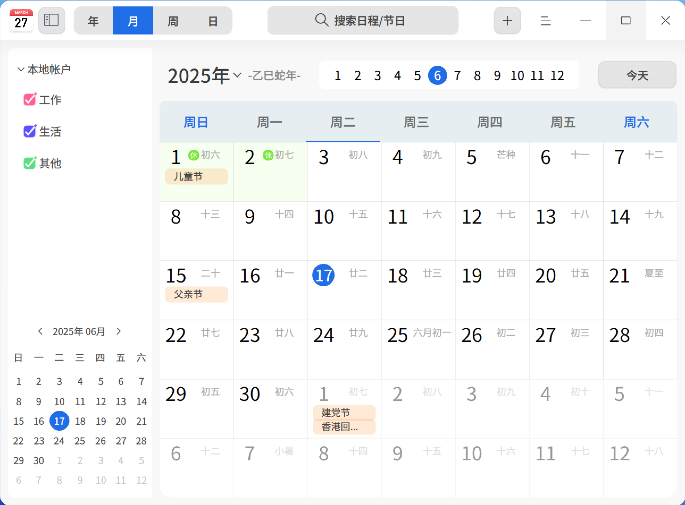

# 日历|dde-calendar|

## 概述

日历是一款查看日期、管理日程的小工具，支持查看农历、黄历、节气和常见的节日信息等，内置日程提醒功能帮您更好地规划时间。

## 使用入门

通过以下方式运行或关闭日历，或者创建日历的快捷方式。

### 运行日历

1. 单击任务栏上的启动器图标  ，进入启动器界面。
2. 上下滚动鼠标滚轮浏览或通过搜索，找到日历图标 ，单击运行。
3. 右键单击  ，您可以：

   - 单击 **发送到桌面**，在桌面创建快捷方式。
   - 单击 **发送到任务栏**，将应用程序固定到任务栏。
   - 单击 **开机自动启动**，将应用程序添加到开机启动项，在电脑开机时自动运行该应用。

### 关闭日历

- 在日历界面单击  ，退出日历。
- 在任务栏右键单击  ，选择 **关闭所有**，退出日历。
- 在日历界面单击  ，选择 **退出** ，退出日历。

### 查看快捷键

在日历界面，使用快捷键 **Ctrl + Shift + ?** 打开快捷键预览界面。熟练地使用快捷键，将大大提升您的操作效率。

## 操作介绍

日历分为年、月、周、日视图，通过不同的视图方式展示日期属性。

系统默认显示月视图，可以通过鼠标点击切换年、月、周、日视图。

- 仅在中文系统中，日历会显示日期所对应的农历日期、黄历和节日信息。
- 日期以 **1900** 年为起点，在日期切换时，不能查看早于 **1900** 年的日期。
- 在月视图、周视图中，周六、周日的日期显示会区别于周一至周五。

日历视图中的侧边栏展示日历帐户以及小日历视图。

1. 单击 可切换窗口中侧边栏的展示和隐藏。
2. 在日历帐户中勾选相应的日历类型，则该类型下的日程在日历视图中展示；若取消勾选，则在视图中隐藏。
3. 在侧边栏下方的小日历中点选日期，可联动控制右侧大日历视图的日期展示。

<table border="1">
<tr>
   <th width="80px">视图</th>
   <th width=“200px”>说明</th>
</tr>
<tr>
   <td>年</td>
   <td>显示全年的月份、天数。</td>
</tr>
<tr>
   <td>月</td>
    <td>显示节日信息、日程安排。</td>
</tr>
<tr>
   <td>周</td>
   <td>显示这一周每天的日程安排。</td>
</tr>
<tr>
   <td>日</td>
   <td>显示节日信息、详细的日程安排和黄历。</td>
</tr> 
</table>

### 新建日程

1. 通过以下方法之一新建日程。
   - 在日历界面，单击菜单栏上的添加按钮 。
   - 在月、周或日视图中，双击日期空白处或单击鼠标右键选择 **新建日程**。
   - 在月、周或日视图中，单击鼠标拖拽新建日程。
   
2. 弹出“新建日程”窗口，选择日历帐户、设置日程类型、内容、时间、提醒等信息。

<table border="1">
<tr>
   <th width="50px">参数</th>
   <th width="200px">说明</th>
</tr>
<tr>
   <td>日历帐户</td>
   <td>默认本地帐户，可选UOS/deepin ID等网络账户。</td>
</tr>
<tr>
   <td>类型</td>
   <td>系统默认提供“工作”、“生活”、“其他”三种日程类型，您也可以自定义日程类型。
       <ol><li>在类型下拉列表中，选择 <b>新增日程类型</b>。</li>
          <li>类型框呈可编辑状态，输入类型名称，设置颜色。</li></ol>
       您也可以通过主菜单中的管理功能新增、编辑或删除日程类型，具体操作步骤请参考“管理”章节。</td>
</tr>
<tr>
   <td>内容</td>
   <td>日程的描述信息。</td>
</tr>
<tr>
   <td>日程时间</td>
   <td>设置全天或非全天、公历或农历日程的日期和时间。
   <ul>
       <li>全天
        <ul><li>勾选全天：开始时间和结束时间只能设置日期。</li>
           <li> 取消勾选全天：开始时间和结束时间既能设置日期、也能设置小时和分钟。 </li></ul>
        </li>
    </ul>
   <ul>
     <li>时间
        <ul><li>公历：开始时间和结束时间仅显示公历日期。</li>
            <li>农历：开始时间和结束时间显示公历和农历日期。</li></ul>
     </li>
   </ul></td>
</tr>
<tr>
   <td>提醒</td>
   <td>
勾选全天，则提醒设置的选项包含：从不、日程发生当天（上午9点）、1天前、 2天前或1周前。 
取消勾选全天，则提醒设置的选项包含：从不、日程开始时、15分钟前、30分钟前、1小时前、1天前、 2天前或1周前。</td>
</tr>
<tr>
   <td>重复</td>
   <td>
选择公历日程，则重复设置的选项包含：从不、每天、工作日、每周、每月或每年。 
选择农历日程，则重复设置的选项包含：从不、每月或每年。</td>
</tr>
<tr>
   <td>结束重复</td>
   <td>只有设置了重复功能，<b>结束重复</b> 才会出现。结束重复的选项包含：从不、于n次后或于日期。</td>
</tr> 
</table>

3. 单击 **保存**，创建日程。日程创建完成后，会以标签形式呈现在日历视图中。

### 编辑日程

1. 在月、周或日视图中，双击或右键单击日程标签。
2. 选择 **编辑**。
3. 弹出“编辑日程”窗口，设置编辑日程的相关属性，单击 **保存**。 
4. 如果设置了全天或重复，则弹出提示框，确认提示信息后，完成日程编辑。

>  说明：已创建的日程可以通过拖拽日程标签来修改日程的开始时间和结束时间。

编辑日程时，系统会根据所更改内容的不同显示不同的提示信息。提示信息中按钮说明如下表。

<table border="1">
<tr>
   <th width="130px">按钮</th>
   <th width=“200px”>说明</th>
</tr>
<tr>
   <td>全部日程</td>
   <td>修改所有与此相关的重复日程。 </td>
</tr>
<tr>
   <td>仅此日程</td>
   <td>只修改当前日程。  </td>
</tr>
<tr>
   <td>所有将来日程</td>
   <td>修改选中日期及以后日期的日程，选中的日期之前的日程仍然保留。</td>
</tr>
<tr>
   <td>全部更改  </td>
   <td>修改所有重复日程。</td>
</tr> 
</table>

### 设置全天或多天日程

在创建或编辑日程时，设置 **开始时间**、**结束时间**，可以设置全天或多天持续的日程。

### 设置重复日程

1. 在创建或编辑日程时，在 **重复** 的下拉列表中选择重复提醒日程的周期，例如，每月。
2. 在 **结束重复** 的下拉列表中设置结束重复的次数或停止日期。

### 搜索日程

1. 在日历界面顶部搜索框中，单击 ，输入关键字。
2. 按下键盘上的 **Enter** 键进行搜索。
3. 在搜索框中单击  或删除输入的信息，清除当前输入的关键字或取消搜索。

### 查看日程

在月、周或日视图中，双击日程标签，弹出“我的日程”窗口，此时既可以查看日程，也可以 [编辑日程](#编辑日程) 或 [删除日程](#删除日程)。

### 查看日程提醒详情

当系统发出通知后，单击通知提示框，查看日程详情。

日程提醒时，提示信息按钮说明如下表。

<table border="1">
<tr>
   <th width="130px">按钮</th>
   <th width=“200px”>说明</th>
</tr>
<tr>
   <td>稍后提醒</td>
   <td>提醒设置为当天，首次提醒后，单击 <b>稍后提醒</b>，10分钟后再次提醒，此后每次单击“稍后提醒”增加5分钟的时间间隔。 您也可以在"稍后提醒"下拉列表中，选择15分钟后、1小时后、4小时后或明天。 </td>
</tr>
<tr>
   <td>明天提醒</td>
   <td>当提醒设置为1天前或2天前时，出现该按钮。   </td>
</tr>
<tr>
   <td>提前1天提醒 </td>
   <td>当提醒设置为1周前时，出现该按钮。</td>
</tr>
<tr>
   <td>关闭</td>
   <td>关闭提示信息。</td>
</tr> 
</table>

### 删除日程

1. 在月、周或日视图中，双击或右键单击日程标签。
2. 选择 **删除**。
3. 弹出“您正在删除日程”提示框，单击 **删除**，删除该日程。

删除日程时，重复与非重复日程提示信息中的按钮说明如下表。

<table border="1">
<tr>
   <th width="130px">按钮</th>
   <th width=“200px”>说明</th>
</tr>
<tr>
   <td>删除日程</td>
   <td>删除非重复日程。  </td>
</tr>
<tr>
   <td>全部删除</td>
   <td>删除所有重复日程。</td>
</tr>
<tr>
   <td>仅删除此日程 </td>
   <td>针对重复日程，仅删除当前所选的日程。</td>
</tr>
<tr>
   <td>删除所有将来日程</td>
   <td> 针对重复日程，删除当前选中日期及以后日期的日程，选中的日期之前的日程仍然保留。</td>
</tr> 
</table>

## 主菜单

在主菜单中，您可以打开管理设置、查看隐私政策、切换窗口主题、查看帮助手册、了解日历的更多信息。

### 管理

单击  > **管理**，进入日历管理界面，您可以管理日历帐户的日程类型、登录UOS/deepin ID将日程数据和日历配置同步至云端，同时也可以对通用配置进行设置。

#### 日历云同步

日历支持通过UOS/deepin ID将日程数据及设置同步至云端。

>  说明：该功能暂不对老版本UOS/deepin系统开放。

**登录和登出UOS/deepin ID**

1. 在帐户设置界面，点击 **登录** 按钮。
2. 弹出UOS/deepin ID登录弹窗，在弹窗中通过账号密码、手机验证码或微信扫码等方式完成UOS/deepin ID登录。
3. 登录后显示账户名、头像和相关同步设置，点击 **退出登录** 按钮可将UOS/deepin ID账号登出。

**日历同步设置**

1. UOS/deepin ID登录状态下，点击 **日程** 、 **通用设置** 后的复选框，设置是否同步至云端。

2. 点击 **同步频率** 后的下拉框，可选择系统自动同步的频率，您也可以选中 **手动同步** ，关闭自动同步模式。

3. 点击 **立即同步** 按钮，立即和云端数据进行同步。

>  说明：需在控制中心开启 **UOS/deepin Cloud同步**，才能使用云同步功能。

#### 管理日程类型

**新增日程类型**

1. 在日历管理界面，单击添加按钮 。
2. 弹出“新增日程类型”窗口，输入类型名称，设置颜色。
3. 单击 **保存**。

**编辑日程类型**

1. 在日历管理界面，选择某一个自定义类型。
2. 单击编辑按钮  。
3. 弹出“编辑日程类型”窗口，输入类型名称，设置颜色。
4. 单击 **保存**。

**删除日程类型**

1. 在帐户设置界面，选择某一个自定义类型。
2. 单击删除按钮  ，删除该日程类型。

#### 通用设置

**一周首日**

点击 **每星期开始于** 后的下拉框，可选中 **周日** 或 **周一** 设置为每周的第一天。

**时间格式**

点击 **时间** 后的下拉框，选中 **24小时制** 或 **12小时制** ，则日历中的时间格式将按选中项进行展示。

### 主题

窗口主题包含浅色主题、深色主题和系统主题。

1. 在日历界面，单击 。
2. 选择 **主题**，选择一个主题颜色。

### 帮助

查看帮助手册，进一步了解和使用日历。

1. 在日历界面，单击 。
2. 选择 **帮助**。
3. 查看日历的帮助手册。

### 关于

1. 在日历界面，单击 。
2. 选择 **关于**。
3. 查看日历的版本和介绍。

### 退出

1. 在日历界面，单击 。
2. 选择 **退出**。

