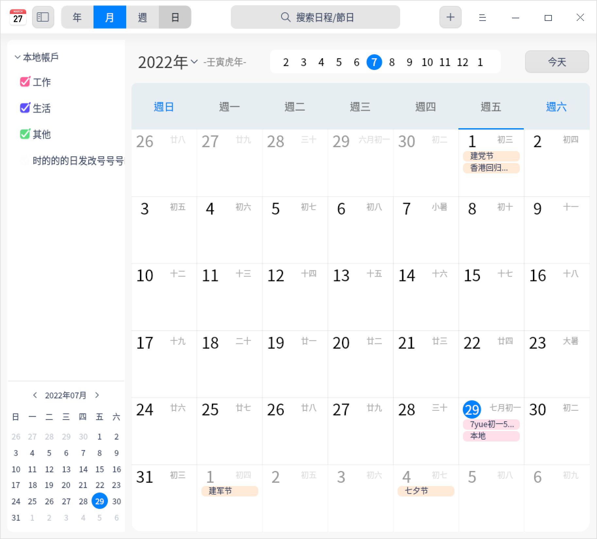
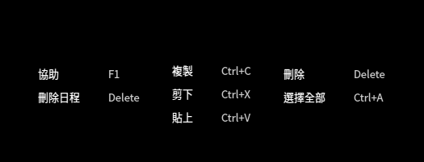
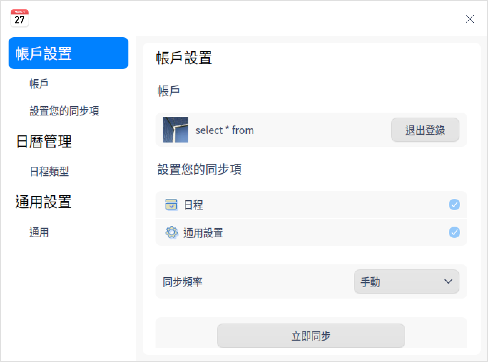

# 日曆|dde-calendar|

## 概述

日曆是一款查看日期、管理日程的小工具，支持查看農曆、黃曆、節氣和常見的節日訊息等，內置日程提醒功能幫您更好地規劃時間。

## 使用入門

通過以下方式運行或關閉日曆，或者創建日曆的快捷方式。

### 運行日曆

1. 單擊任務欄上的啟動器圖標 ，進入啟動器界面。
2. 上下滾動鼠標滾輪瀏覽或通過搜索，找到日曆圖標 ，單擊運行。
3. 右鍵單擊 ，您可以：

   - 單擊 **傳送到桌面**，在桌面創建快捷方式。
   - 單擊 **傳送到任務欄**，將應用程序固定到任務欄。
   - 單擊 **加至開機啟動**，將應用程序添加到開機啟動項，在電腦開機時自動運行該應用。

### 關閉日曆

- 在日曆界面單擊 ，關閉日曆。
- 在任務欄右鍵單擊 ，選擇 **關閉所有**，關閉日曆。
- 在日曆界面單擊 ，選擇 **退出**，關閉日曆。

### 查看快捷鍵

在日曆界面，使用快捷鍵 **Ctrl + Shift + ?** 打開快捷鍵預覽界面。熟練地使用快捷鍵，將大大提升您的操作效率。

## 操作介紹

日曆分為年、月、周、日視圖，通過不同的視圖方式展示日期屬性。

系統默認顯示月視圖，可以通過鼠標單擊切換年、月、周、日視圖。

- 僅在中文系統中，日曆會顯示日期所對應的農曆日期、黃曆和節日訊息。
- 日期以 **1900** 年為起點，在日期切換時，不能查看早於 **1900** 年的日期。
- 在月視圖、周視圖中，週六、週日的日期顯示會區別於週一至週五。

日歷視圖中的側邊欄展示日歷帳戶以及小日歷視圖。

1. 單擊 可切換窗口中側邊欄的展示和隱藏。
2. 在日歷帳戶中勾選相應的日歷類型，則該類型下的日程在日歷視圖中展示；若取消勾選，則在視圖中隱藏。
3. 在側邊欄下方的小日歷中點選日期，可聯動控製右側大日歷視圖的日期展示。

<table border="1">
<tr>
   <th width="80px">視圖</th>
   <th width=“200px”>說明</th>
</tr>
<tr>
   <td>年</td>
   <td>顯示全年的月份、天數。</td>
</tr>
<tr>
   <td>月</td>
    <td>顯示節日訊息、日程安排。</td>
</tr>
<tr>
   <td>周</td>
   <td>顯示這一週每天的日程安排。</td>
</tr>
<tr>
   <td>日</td>
   <td>顯示節日訊息、詳細的日程安排和黃曆。</td>
</tr> 
</table>

### 新建日程

1. 通過以下方法之一新建日程。
   - 在日曆界面，單擊菜單欄上的添加按鈕 。
   - 在月、周或日視圖中，雙擊日期空白處或單擊鼠標右鍵選擇 **新建日程**。
   - 在月、周或日視圖中，單擊鼠標拖拽新建日程。
   
2. 彈出「新建日程」窗口，選擇日歷帳戶、設置日程類型、內容、時間、提醒等訊息。

<table border="1">
<tr>
   <th width="50px">參數</th>
   <th width="200px">說明</th>
</tr>
<tr>
   <td>日歷帳戶</td>
   <td>默認本地帳戶，可選UOS ID等網絡賬戶。</td>
</tr>
<tr>
   <td>類型</td>
   <td>系統默認提供「工作」、「生活」、「其他」三種日程類型，您也可以自定義日程類型。
       <ol><li>在類型下拉列表中，選擇 <b>新增日程類型</b>。</li>
          <li>類型框呈可編輯狀態，輸入類型名稱，設置顏色。</li></ol>
       您也可以通過主菜單中的管理功能新增、編輯或刪除日程類型，具體操作步驟請參考「管理」章節。</td>
</tr>
<tr>
   <td>內容</td>
   <td>日程的描述訊息。</td>
</tr>
<tr>
   <td>日程時間</td>
   <td>設置全天或非全天、公曆或農曆日程的日期和時間。
   <ul>
       <li>全天
           <ul><li>勾選全天：開始時間和結束時間只能設置日期。 </li>
               <li> 取消勾選全天：開始時間和結束時間既能設置日期、也能設置小時和分鐘。 </li></ul>
       </li>
    </ul>
   <ul>
     <li>時間
          <ul><li>公曆：開始時間和結束時間僅顯示公曆日期。</li>
               <li>農曆：開始時間和結束時間顯示公曆和農曆日期。</li></ul>
       </li>
   </ul></td>
</tr>
<tr>
   <td>提醒</td>
   <td>
勾選全天，則提醒設置的選項包含：永不、日程發生當天（上午9點）、1天前、 2天前或1週前。 
取消勾選全天，則提醒設置的選項包含：永不、日程開始時、15分鐘前、30分鐘前、1小時前、1天前、 2天前或1週前。</td>
</tr>
<tr>
   <td>重複</td>
   <td>
選擇公曆日程，則重複設置的選項包含：永不、每天、工作日、每週、每月或每年。 
選擇農曆日程，則重複設置的選項包含：永不、每月或每年。</td>
</tr>
<tr>
   <td>結束重複</td>
   <td>只有設置了重複功能，<b>結束重複</b> 才會出現。結束重複的選項包含：永不、於n次後或於日期。</td>
</tr> 
</table>

3. 單擊 **保存**，創建日程。日程創建完成後，會以標籤形式呈現在日曆視圖中。

### 編輯日程

1. 在月、周或日視圖中，雙擊或右鍵單擊日程標籤。
2. 選擇 **編輯**。
3. 彈出「編輯日程」窗口，設置編輯日程的相關屬性，單擊 **保存**。 
4. 如果設置了全天或重複，則彈出提示框，確認提示訊息後，完成日程編輯。

>  說明：已創建的日程可以通過拖拽日程標籤來修改日程的開始時間和結束時間。

編輯日程時，系統會根據所更改內容的不同顯示不同的提示訊息。提示訊息中按鈕說明如下表。

<table border="1">
<tr>
   <th width="130px">按鈕</th>
   <th width=“200px”>說明</th>
</tr>
<tr>
   <td>全部日程</td>
   <td>修改所有與此相關的重複日程。 </td>
</tr>
<tr>
   <td>僅此日程</td>
   <td>只修改當前日程。  </td>
</tr>
<tr>
   <td>所有將來日程</td>
   <td>修改選中日期及以後日期的日程，選中的日期之前的日程仍然保留。</td>
</tr>
<tr>
   <td>全部更改  </td>
   <td>修改所有重複日程。</td>
</tr> 
</table>

### 設置全天或多天日程

在創建或編輯日程時，設置 **開始時間**、**結束時間**，可以設置全天或多天持續的日程。

### 設置重複日程

1. 在創建或編輯日程時，在 **重複** 的下拉列表中選擇重複提醒日程的週期，例如，每月。
2. 在 **結束重複** 的下拉列表中設置結束重複的次數或停止日期。

### 搜索日程

1. 在日曆界面頂部搜索框中，單擊 ，輸入關鍵字。
2. 按下鍵盤上的 **Enter** 鍵進行搜索。
3. 在搜索框中單擊  或刪除輸入的訊息，清除當前輸入的關鍵字或取消搜索。

### 查看日程

在月、周或日視圖中，雙擊日程標籤，彈出「我的日程」窗口，此時既可以查看日程，也可以 [編輯日程](#編輯日程) 或 [刪除日程](#刪除日程)。

### 查看日程提醒詳情

當系統發出通知後，單擊通知提示框，查看日程詳情。

日程提醒時，提示訊息按鈕說明如下表。

<table border="1">
<tr>
   <th width="130px">按鈕</th>
   <th width=“200px”>說明</th>
</tr>
<tr>
   <td>稍後提醒</td>
   <td>提醒設置為當天，首次提醒後，單擊 <b>稍後提醒</b>，10分鐘後再次提醒，此後每次單擊「稍後提醒」增加5分鐘的時間間隔。 您也可以在「稍後提醒」下拉列表中，選擇15分鐘後、1小時後、4小時後或明天。 </td>
</tr>
<tr>
   <td>明天提醒</td>
   <td>當提醒設置為1天前或2天前時，出現該按鈕。   </td>
</tr>
<tr>
   <td>提前1天提醒 </td>
   <td>當提醒設置為1週前時，出現該按鈕。</td>
</tr>
<tr>
   <td>關閉</td>
   <td>關閉提示訊息。</td>
</tr> 
</table>

### 刪除日程

1. 在月、周或日視圖中，雙擊或右鍵單擊日程標籤。
2. 選擇 **刪除**。
3. 彈出「您正在刪除日程」提示框，單擊 **刪除**，刪除該日程。

刪除日程時，重複與非重複日程提示訊息中的按鈕說明如下表。

<table border="1">
<tr>
   <th width="130px">按鈕</th>
   <th width=“200px”>說明</th>
</tr>
<tr>
   <td>刪除日程</td>
   <td>刪除非重複日程。  </td>
</tr>
<tr>
   <td>全部刪除</td>
   <td>刪除所有重複日程。</td>
</tr>
<tr>
   <td>僅刪除此日程 </td>
   <td>針對重複日程，僅刪除當前所選的日程。</td>
</tr>
<tr>
   <td>刪除所有將來日程</td>
   <td> 針對重複日程，刪除當前選中日期及以後日期的日程，選中的日期之前的日程仍然保留。</td>
</tr> 
</table>

## 主菜單

在主菜單中，您可以打開管理設置、查看隱私政策、切換窗口主題、查看幫助手冊、了解日歷的更多訊息。

### 管理

單擊  > **管理**，進入日歷管理界面，您可以管理日歷帳戶的日程類型、登錄UOS ID將日程數據和日歷配置同步至雲端，同時也可以對通用配置進行設置。

#### 日历云同步

日歷支持通過UOS ID將日程數據及設置同步至雲端。

>  說明：該功能暫不對老版本系統開放。

**登錄和登出UOS ID**

1. 在帳戶設置界面，點擊 **登錄** 按鈕。
2. 彈出UOS ID登錄彈窗，在彈窗中通過賬號密碼、手機驗證碼或微信掃碼等方式完成UOS ID登錄。
3. 登錄後顯示賬戶名、頭像和相關同步設置，點擊 **退出登錄** 按鈕可將UOS ID賬號登出。

**日歷同步設置**

1. UOS ID登錄狀態下，點擊 **日程** 、 **通用設置** 後的復選框，設置是否同步至雲端。
2. 點擊 **同步頻率** 後的下拉框，可選擇系統自動同步的頻率，您也可以選中 **手動同步** ，關閉自動同步模式。
3. 點擊 **立即同步** 按鈕，立即和雲端數據進行同步。

>  說明：需在控制中心開啟 **UOS Cloud同步**，才能使用雲同步功能。

#### 管理日程類型

**新增日程類型**

1. 在日曆管理界面，單擊添加按鈕 。
2. 彈出「新增日程類型」窗口，輸入類型名稱，設置顏色。
3. 單擊 **保存**。

**編輯日程類型**

1. 在日曆管理界面，選擇某一個自定義類型。
2. 單擊編輯按鈕  。
3. 彈出「編輯日程類型」窗口，輸入類型名稱，設置顏色。
4. 單擊 **保存**。

**刪除日程類型**

1. 在日曆管理界面，選擇某一個自定義類型。
2. 單擊刪除按鈕  ，刪除該日程類型。

#### 通用設置

**一周首日**

點擊 **每星期開始於** 後的下拉框，可選中 **周日** 或 **周一** 設置為每周的第一天。

**時間格式**

點擊 **時間** 後的下拉框，選中 **24小時製** 或 **12小時製** ，則日歷中的時間格式將按選中項進行展示。

### 主題

窗口主題包含淺色主題、深色主題和系統主題。

1. 在日曆界面，單擊 。
2. 選擇 **主題**，選擇一個主題顏色。

### 幫助

查看幫助手冊，進一步了解和使用日曆。

1. 在日曆界面，單擊 。
2. 選擇 **幫助**。
3. 查看日曆的幫助手冊。

### 關於

1. 在日曆界面，單擊 。
2. 選擇 **關於**。
3. 查看日曆的版本和介紹。

### 退出

1. 在日曆界面，單擊 。
2. 選擇 **退出**。