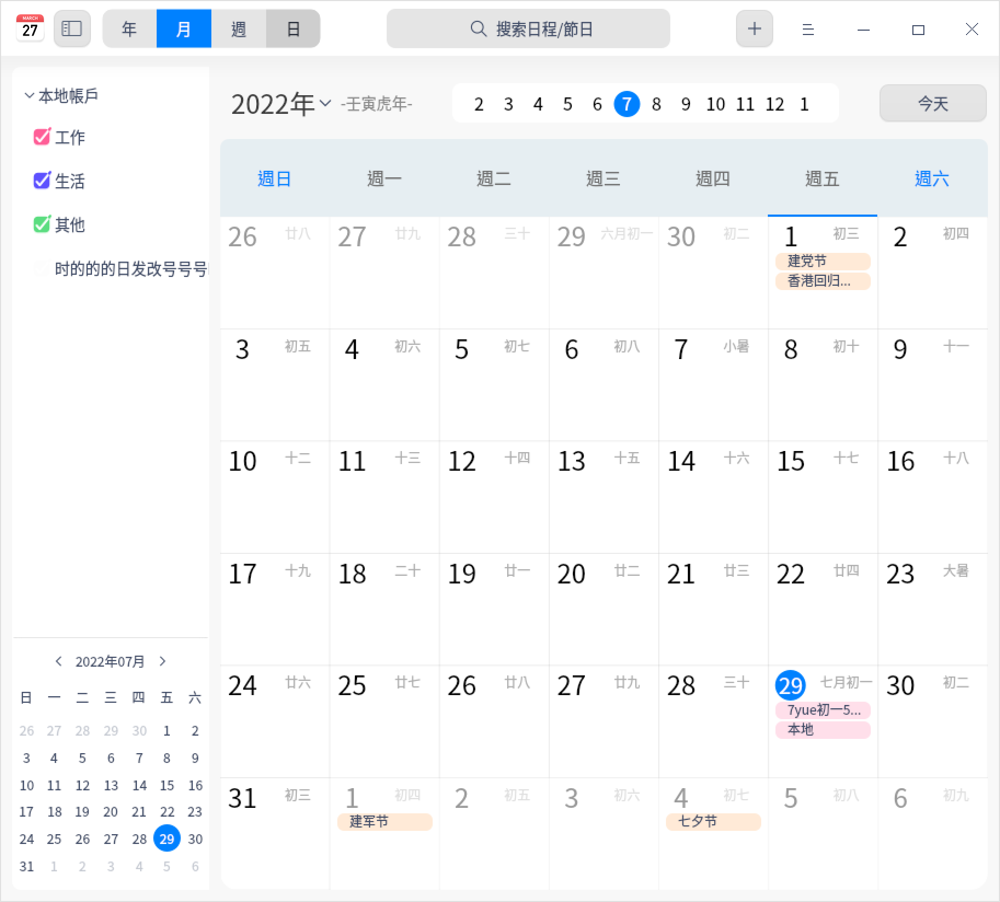

# 日曆|dde-calendar|

## 概述

日曆是一款檢視日期、管理行程的小工具，支援檢視農曆、黃曆、節氣和常見的節日資訊等，內建行程提醒功能幫您更好地規劃時間。

## 使用入門

透過以下方式執行或關閉日曆，或者建立日曆的捷徑。

### 執行日曆

1. 按一下工作列上的啟動器圖示 ，進入啟動器介面。
2. 滾動滑鼠或搜尋，找到日曆圖示 ，按一下執行。
3. 右鍵按一下 ，您可以：
   - 按一下 **傳送到桌面**，在桌面建立捷徑。
   - 按一下 **釘選到工作列**，將應用程式固定到工作列。
   - 按一下 **開機自動啟動**，將應用程式加入到開機啟動項，在電腦開機時自動執行該應用。

### 關閉日曆

- 在日曆介面按一下 ，退出日曆。
- 在工作列右鍵按一下 ，選擇 **全部關閉**，退出日曆。
- 在日曆介面按一下 ，選擇 **結束**，退出日曆。

### 檢視快速鍵

在日曆介面，使用快速鍵 **Ctrl + Shift + ?** 開啟快速鍵預覽介面。熟練地使用快速鍵，將大大提升您的操作效率。

## 操作介紹

日曆分為年、月、週、日檢視，透過不同的檢視方式展示日期屬性。

系統預設顯示月檢視，可以透過滑鼠點擊切換年、月、週、日檢視。

- 僅在中文系統中：日曆會顯示日期所對應的農曆日期、黃曆和節日資訊。
- 日期以 **1900** 年為起點，在日期切換時，不能檢視早於 **1900** 年的日期。
- 在月檢視、週檢視中，週六、週日的日期顯示會區別於週一至週五。

日曆檢視中的側邊欄展示日曆帳號以及小日曆檢視。

1. 按一下 可切換視窗中側邊欄的展示和隱藏。
2. 在日曆帳號中勾選相應的日曆類型，則該類型下的行程在日曆檢視中展示；若取消勾選，則在檢視中隱藏。
3. 在側邊欄下方的小日曆中點選日期，可聯動控制右側大日曆檢視的日期展示。

<table border="1">
<tr>
   <th width="80px">檢視</th>
   <th width="200px">說明</th>
</tr>
<tr>
   <td>年</td>
   <td>顯示全年的月份、天數。</td>
</tr>
<tr>
   <td>月</td>
    <td>顯示節日資訊、行程安排。</td>
</tr>
<tr>
   <td>週</td>
   <td>顯示這一週每天的行程安排。</td>
</tr>
<tr>
   <td>日</td>
   <td>顯示節日資訊、詳細的行程安排和黃曆。</td>
</tr> 
</table>

### 新增行程

1. 透過以下方法之一新增行程。
   - 在日曆介面，按一下選單欄上的新增按鈕 。
   - 在月、週或日檢視中，雙擊日期空白處或按一下滑鼠右鍵選擇 **新增行程**。
   - 在月、週或日檢視中，按一下滑鼠拖曳新增行程。
   
2. 彈出「新增行程」視窗，選擇日曆帳號、設定行程類型、內容、時間、提醒等資訊。

<table border="1">
<tr>
   <th width="50px">參數</th>
   <th width="200px">說明</th>
</tr>
<tr>
   <td>日曆帳號</td>
   <td>預設本地帳號，可選UOS ID等網路帳號。</td>
</tr>
<tr>
   <td>類型</td>
   <td>系統預設提供「工作」、「生活」、「其他」三種行程類型，您也可以自訂行程類型。
       <ol><li>在類型下拉清單中，選擇 <b>新增行程類型</b>。</li>
          <li>類型框呈可編輯狀態，輸入類型名稱，設定顏色。</li></ol>
       您也可以透過主選單中的管理功能新增、編輯或刪除行程類型，具體操作步驟請參考「管理」章節。</td>
</tr>
<tr>
   <td>內容</td>
   <td>行程的描述資訊。</td>
</tr>
<tr>
   <td>行程時間</td>
   <td>設定全天或非全天、國曆或農曆行程的日期和時間。
   <ul>
       <li>全天
        <ul><li>勾選全天：開始時間和結束時間只能設定日期。</li>
           <li> 取消勾選全天：開始時間和結束時間既能設定日期、也能設定小時和分鐘。 </li></ul>
        </li>
    </ul>
   <ul>
     <li>時間
        <ul><li>國曆：開始時間和結束時間僅顯示國曆日期。</li>
            <li>農曆：開始時間和結束時間顯示國曆和農曆日期。</li></ul>
     </li>
   </ul></td>
</tr>
<tr>
   <td>提醒</td>
   <td>
勾選全天，則提醒設定的選項包含：永不、行程發生當天（上午9點）、1天前、 2天前或1週前。 
取消勾選全天，則提醒設定的選項包含：永不、行程開始時、15分鐘前、30分鐘前、1小時前、1天前、 2天前或1週前。</td>
</tr>
<tr>
   <td>重複</td>
   <td>
選擇國曆行程，則重複設定的選項包含：永不、每天、工作日、每週、每月或每年。 
選擇農曆行程，則重複設定的選項包含：永不、每月或每年。</td>
</tr>
<tr>
   <td>結束重複</td>
   <td>只有設定了重複功能，<b>結束重複</b> 才會出現。結束重複的選項包含：永不、於n次後或於日期。</td>
</tr> 
</table>

3. 按一下 **儲存**，建立行程。行程建立完成後，會以標籤形式呈現在日曆檢視中。

### 編輯行程

1. 在月、週或日檢視中，雙擊或右鍵按一下行程標籤。
2. 選擇 **編輯**。
3. 彈出「編輯行程」視窗，設定編輯行程的相關屬性，按一下 **儲存**。 
4. 如果設定了全天或重複，則彈出提示框，確認提示資訊後，完成行程編輯。

>  說明：已建立的行程可以透過拖曳行程標籤來修改行程的開始時間和結束時間。

編輯行程時，系統會根據所更改內容的不同顯示不同的提示資訊。提示資訊中按鈕說明如下表。

<table border="1">
<tr>
   <th width="130px">按鈕</th>
   <th width="200px">說明</th>
</tr>
<tr>
   <td>所有行程</td>
   <td>修改所有與此相關的重複行程。</td>
</tr>
<tr>
   <td>僅此行程</td>
   <td>只修改當前行程。</td>
</tr>
<tr>
   <td>所有將來行程</td>
   <td>修改選中日期及以後日期的行程，選中的日期之前的行程仍然保留。</td>
</tr>
<tr>
   <td>全部變更</td>
   <td>修改所有重複行程。</td>
</tr> 
</table>

### 設定全天或多天行程

在建立或編輯行程時，設定 **開始時間**、**結束時間**，可以設定全天或多天持續的行程。

### 設定重複行程

1. 在建立或編輯行程時，在 **重複** 的下拉清單中選擇重複提醒行程的週期，例如，每月。
2. 在 **結束重複** 的下拉清單中設定結束重複的次數或停止日期。

### 搜尋行程

1. 在日曆介面頂部搜尋框中，按一下 ，輸入關鍵字。
2. 按下鍵盤上的 **Enter** 鍵進行搜尋。
3. 在搜尋框中按一下  或刪除輸入的資訊，清除當前輸入的關鍵字或取消搜尋。

### 檢視行程

在月、週或日檢視中，雙擊行程標籤，彈出「我的行程」視窗，此時既可以檢視行程，也可以 [編輯行程](#編輯行程) 或 [刪除行程](#刪除行程)。

### 檢視行程提醒詳情

當系統發出通知後，按一下通知提示框，檢視行程詳情。

行程提醒時，提示資訊按鈕說明如下表。

<table border="1">
<tr>
   <th width="130px">按鈕</th>
   <th width="200px">說明</th>
</tr>
<tr>
   <td>稍後提醒</td>
   <td>提醒設定為當天，首次提醒後，按一下 <b>稍後提醒</b>，10分鐘後再次提醒，此後每次按一下「稍後提醒」增加5分鐘的時間間隔。 您也可以在"稍後提醒"下拉清單中，選擇15分鐘後、1小時後、4小時後或明天。</td>
</tr>
<tr>
   <td>明天提醒</td>
   <td>當提醒設定為1天前或2天前時，出現該按鈕。</td>
</tr>
<tr>
   <td>提前1天提醒</td>
   <td>當提醒設定為1週前時，出現該按鈕。</td>
</tr>
<tr>
   <td>關閉</td>
   <td>關閉提示資訊。</td>
</tr> 
</table>

### 刪除行程

1. 在月、週或日檢視中，雙擊或右鍵按一下行程標籤。
2. 選擇 **刪除**。
3. 彈出「您正在刪除行程」提示框，按一下 **刪除**，刪除該行程。

刪除行程時，重複與非重複行程提示資訊中的按鈕說明如下表。

<table border="1">
<tr>
   <th width="130px">按鈕</th>
   <th width="200px">說明</th>
</tr>
<tr>
   <td>刪除行程</td>
   <td>刪除非重複行程。</td>
</tr>
<tr>
   <td>全部刪除</td>
   <td>刪除所有重複行程。</td>
</tr>
<tr>
   <td>僅刪除此行程</td>
   <td>針對重複行程，僅刪除當前所選的行程。</td>
</tr>
<tr>
   <td>刪除所有將來行程</td>
   <td>針對重複行程，刪除當前選中日期及以後日期的行程，選中的日期之前的行程仍然保留。</td>
</tr> 
</table>

## 主選單

在主選單中，您可以開啟管理設定、檢視隱私政策、切換視窗主題、檢視說明手冊、了解日曆的更多資訊。

### 管理

按一下  > **管理**，進入日曆管理介面，您可以管理日曆帳號的行程類型、登入UOS ID將行程資料和日曆設定同步至雲端，同時也可以對通用設定進行設定。

#### 日曆雲同步

日曆支援透過UOS ID將行程資料及設定同步至雲端。

>  說明：該功能暫不對舊版本UOS系統開放。

**登入和登出UOS ID**

1. 在帳號設定介面，點擊 **登入** 按鈕。
2. 彈出UOS ID登入視窗，在視窗中透過帳號密碼、手機驗證碼或微信掃碼等方式完成UOS ID登入。
3. 登入後顯示帳戶名、頭像和相關同步設定，點擊 **登出** 按鈕可將UOS ID帳號登出。

**日曆同步設定**

1. UOS ID登入狀態下，點擊 **行程** 、 **通用設定** 後的核取方塊，設定是否同步至雲端。
2. 點擊 **同步頻率** 後的下拉方塊，可選擇系統自動同步的頻率，您也可以選中 **手動同步** ，關閉自動同步模式。
3. 點擊 **立即同步** 按鈕，立即和雲端資料進行同步。

>  說明：需在控制中心開啟 **UOS Cloud同步**，才能使用雲同步功能。

#### 管理行程類型

**新增類型**
1. 在日曆管理介面，按一下新增按鈕 。
2. 彈出「新增行程類型」視窗，輸入類型名稱，設定顏色。
3. 按一下 **儲存**。

**編輯類型**
1. 選擇一個自訂類型。
2. 按一下編輯按鈕 。
3. 修改名稱/顏色。
4. 按一下 **儲存**。

**刪除類型**
1. 選擇一個自訂類型。
2. 按一下刪除按鈕 。

#### 通用設定

**每週開始於**  
設定 **週日** 或 **週一** 為每週的第一天。

**時間格式**  
選擇 **24小時制** 或 **12小時制** 格式。

### 主題

視窗主題包含淺色主題、深色主題和系統主題。
1. 在日曆介面，按一下 。
2. 選擇 **主題** > 選擇一個主題。

### 說明

檢視說明手冊了解日曆使用方式。
1. 按一下 。
2. 選擇 **說明**。

### 關於

檢視日曆版本和資訊。
1. 按一下 。
2. 選擇 **關於**。

### 結束

1. 按一下 。
2. 選擇 **結束**。